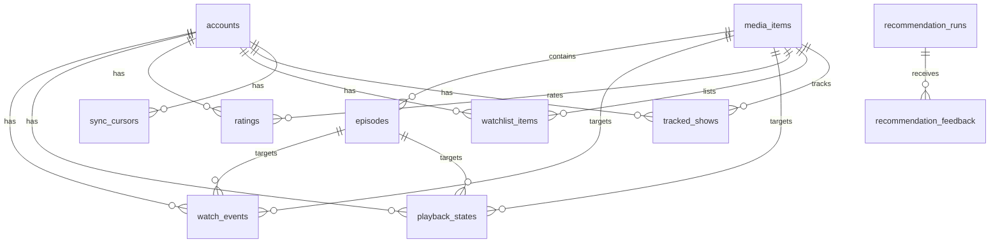

# TVeaker: Full Implementation Plan (Web & Android)

This is the comprehensive, unabridged build plan for **TVeaker** (formerly *Watch Next*), a private, local-first media tracker, finish-time estimator, and intelligent recommendation system for **Web** and **Android**.

The plan preserves all architectural constraints, schemas, mathematical formulas, and test gates from the original specification, and adds the full REST API and native Jetpack Compose Android client architecture.

---

## 1. Outcome & Capabilities

At the end of v1, the user can:

1. **Connect Trakt via OAuth**: One-click local OAuth 2.0 flow with secure credential storage in Windows Credential Manager (`keyring`) and local encrypted fallbacks.
2. **One-Way Viewing Sync**: Import complete Trakt history, ratings (movies, shows, episodes), watchlists, playback states, account settings, and full season/episode catalogs without writing anything back to Trakt.
3. **Background Sync Engine**: Automated incremental sync every 15 minutes using `/sync/last_activities` and a 7-day full reconciliation pass.
4. **Intelligent Screen-Time & Finish Estimator**:
   - Exact remaining runtime for any show (factoring in partial playback progress and specials toggles).
   - Multi-tier runtime fallback chain (episode runtime $\to$ season median $\to$ show runtime $\to$ series median).
   - Rolling 28-day pace estimation (episodes/minutes per day) with show-specific and global fallbacks.
   - Projected calendar finish date (for ended shows) or catch-up date (for ongoing shows) with explicit confidence scores (`high`, `medium`, `low`) and transparent assumptions.
5. **Local Show Tracking**: Manage statuses (`planned`, `watching`, `paused`, `completed`, `dropped`) and manual pace overrides entirely offline in the local database.
6. **Instant Recommendation Engine (<200ms)**:
   - **Pick for Me**: Context-aware instant recommendation (with time filters: `20m`, `45m`, `90m`, `Any`) delivering 1 primary recommendation and 3 backups.
   - Grounded in TF-IDF taste profiles + vector centroids (positive/negative weights derived from ratings 1–10, rewatches, and drops) combined with multi-factor scoring (taste, momentum, runtime fit, completion urgency, explicit intent, novelty, feedback).
   - 100% deterministic and explainable without LLM hallucinations.
7. **Interactive Feedback**: Record `watch this`, `not now` (7-day suppression), and `not interested` (permanent exclusion) to continually refine taste profiles.
8. **Responsive Web Dashboard**: Clean, modern, high-contrast dark UI (Jinja2 + CSS/JS) optimized for both desktop and mobile viewports with zero external CDNs.
9. **Native Android App**: Jetpack Compose + Material 3 client connecting to the TVeaker local/LAN backend with instant "Pick for Me" cards, Up Next episode queues, and full show tracking.
10. **System Doctor & Backups**: Built-in CLI for atomic SQLite backups, migration rollbacks, integrity verification, and diagnostic health checks.

---

## 2. Explicit Scope

### Included in v1
- Single local user and one Trakt account.
- Trakt $\to$ Local one-way sync only (read-only against Trakt).
- Movies and TV shows as recommendation candidates.
- TV episode progress and completion estimates.
- Local show-tracking state and recommendation feedback.
- Local web interface bound to `127.0.0.1` (with LAN access option for Android).
- OpenAPI REST API layer (`/api/v1/*`) powering Web and Android clients.
- Native Android app built with Kotlin, Jetpack Compose, and Material 3.
- Deterministic, content-based recommendation model.
- Windows-first CLI tooling (`tveaker serve`, `sync`, `backup`, `doctor`).

### Excluded from v1
- Writing history, ratings, watchlist changes, or scrobbles back to Trakt.
- Multi-user authentication or cloud-hosted database.
- Live streaming-provider / OTT availability scraping.
- LLM calls directly in the recommendation request path.
- Social or collaborative-filtering network features.
- Remote image scraping until a local compliant image cache is implemented.

---

## 3. Technology Choices

| Component | Technology | Rationale |
|---|---|---|
| **Language** | Python 3.12+ | High performance, rich ML ecosystem, cross-platform |
| **Package Manager** | `uv` | Fast, deterministic dependency resolution and venvs |
| **Backend & API** | FastAPI, Uvicorn | High-throughput async REST API + Jinja2 template rendering |
| **Database** | SQLite (WAL mode), SQLAlchemy 2.0, Alembic | Local-first, zero-maintenance, ACID compliant, embedded |
| **HTTP & Trakt** | HTTPX | Resilient HTTP client with retry, backoff, and pagination |
| **Security** | `keyring`, `itsdangerous`, `hashlib` | OS credential vault (Windows Credential Manager) + CSRF |
| **Machine Learning** | `scikit-learn` | In-memory TF-IDF vectorization and cosine similarity |
| **Testing** | Pytest, `pytest-cov`, `respx`, `time-machine` | Deterministic time mocking, HTTP mocking, 90%+ coverage |
| **Web Frontend** | HTML5, Jinja2, CSS3 (Modern Vanilla), JS | Lightweight, instant load, zero build toolchain overhead |
| **Android Client** | Kotlin, Jetpack Compose, Material 3, Retrofit | Modern native Android architecture, reactive UI |

---

## 4. Domain Glossary

- **Watch event**: An immutable Trakt history row representing one completed watch. Identified by Trakt `history_id`.
- **Playback state**: The latest paused/in-progress percentage for a movie or episode. Replaceable snapshot.
- **Media item**: A movie or TV show that can be rated, tracked, or recommended.
- **Episode**: A numbered segment of a show, identified by a Trakt `episode_id`.
- **Aired episode**: An episode whose `first_aired` is present and $\le$ `now`.
- **Tracked show**: A local preference to follow a show with a local status. Disconnected from Trakt watchlist.
- **Progress**: The unique set of aired episodes watched at least once.
- **Remaining estimate**: Remaining screen minutes across eligible unwatched episodes, with confidence metrics.
- **Catch-up estimate**: Remaining estimate for an ongoing show using aired episodes only.
- **Finish estimate**: Remaining estimate for an ended show.
- **Candidate**: An episode, unstarted show, or movie eligible for recommendation.
- **Recommendation run**: Stored ranking result with context, component score breakdown, and selected items.
- **Feedback**: A local `accepted`, `not_now`, or `not_interested` action modifying future candidate scoring.
- **Sync run**: One attempt to reconcile Trakt datasets into the local database.
- **Activity cursor**: Last successfully synced Trakt activity timestamps per dataset.

---

## 5. Repository Layout

```text
TVeaker/
├── AGENTS.md
├── CONTEXT.md
├── README.md
├── pyproject.toml
├── uv.lock
├── alembic.ini
├── .env.example
├── .gitignore
├── docs/
│   ├── IMPLEMENTATION_PLAN.md
│   └── TRAKT_CONTRACT.md
├── migrations/
│   ├── env.py
│   └── versions/
│       └── 0001_initial.py
├── scripts/
│   ├── run.ps1
│   └── doctor.ps1
├── src/
│   └── tveaker/
│       ├── __init__.py
│       ├── __main__.py
│       ├── config.py
│       ├── clock.py
│       ├── db.py
│       ├── models.py
│       ├── cli.py
│       ├── auth/
│       │   ├── token_store.py
│       │   └── trakt_oauth.py
│       ├── trakt/
│       │   ├── client.py
│       │   ├── errors.py
│       │   ├── pagination.py
│       │   └── schemas.py
│       ├── sync/
│       │   ├── importer.py
│       │   ├── reconcile.py
│       │   └── scheduler.py
│       ├── progress/
│       │   ├── estimator.py
│       │   └── queries.py
│       ├── tracking/
│       │   └── manager.py
│       ├── recommendations/
│       │   ├── candidates.py
│       │   ├── features.py
│       │   ├── ranker.py
│       │   └── explainer.py
│       └── web/
│           ├── app.py
│           ├── dependencies.py
│           ├── api/
│           │   ├── __init__.py
│           │   ├── auth_api.py
│           │   ├── shows_api.py
│           │   ├── recommendations_api.py
│           │   └── sync_api.py
│           ├── routes/
│           │   ├── auth.py
│           │   ├── dashboard.py
│           │   ├── recommendations.py
│           │   ├── settings.py
│           │   ├── shows.py
│           │   └── sync.py
│           ├── templates/
│           │   ├── base.html
│           │   ├── dashboard.html
│           │   ├── settings.html
│           │   ├── show_detail.html
│           │   └── shows.html
│           └── static/
│               ├── app.css
│               ├── app.js
│               └── manifest.json
├── android/
│   ├── app/
│   │   ├── build.gradle.kts
│   │   ├── proguard-rules.pro
│   │   └── src/main/
│   │       ├── AndroidManifest.xml
│   │       ├── java/com/tveaker/app/
│   │       │   ├── MainActivity.kt
│   │       │   ├── TVeakerApp.kt
│   │       │   ├── data/
│   │       │   │   ├── api/
│   │       │   │   │   ├── TVeakerApiService.kt
│   │       │   │   │   └── ApiModels.kt
│   │       │   │   └── repository/
│   │       │   │       ├── TVeakerRepository.kt
│   │       │   │       └── PreferencesManager.kt
│   │       │   ├── ui/
│   │       │   │   ├── navigation/
│   │       │   │   │   └── NavGraph.kt
│   │       │   │   ├── dashboard/
│   │       │   │   │   ├── DashboardScreen.kt
│   │       │   │   │   └── DashboardViewModel.kt
│   │       │   │   ├── shows/
│   │       │   │   │   ├── ShowsScreen.kt
│   │       │   │   │   ├── ShowDetailScreen.kt
│   │       │   │   │   └── ShowsViewModel.kt
│   │       │   │   ├── settings/
│   │       │   │   │   ├── SettingsScreen.kt
│   │       │   │   │   └── SettingsViewModel.kt
│   │       │   │   └── theme/
│   │       │   │       ├── Color.kt
│   │       │   │       ├── Theme.kt
│   │       │   │       └── Type.kt
│   │       └── res/
│   │           ├── values/
│   │           └── mipmap/
│   ├── build.gradle.kts
│   ├── settings.gradle.kts
│   └── gradle/wrapper/
├── tests/
│   ├── conftest.py
│   ├── fixtures/trakt/
│   ├── test_config.py
│   ├── test_db.py
│   ├── test_models.py
│   ├── auth/
│   │   ├── test_token_store.py
│   │   └── test_trakt_oauth.py
│   ├── trakt/
│   │   ├── test_client.py
│   │   └── test_pagination.py
│   ├── sync/
│   │   ├── test_initial_sync.py
│   │   ├── test_incremental_sync.py
│   │   ├── test_episode_catalog.py
│   │   └── test_full_reconciliation.py
│   ├── progress/
│   │   └── test_estimator.py
│   ├── tracking/
│   │   └── test_manager.py
│   ├── recommendations/
│   │   ├── test_candidates.py
│   │   ├── test_features.py
│   │   ├── test_ranker.py
│   │   └── test_explainer.py
│   └── web/
│       ├── test_dashboard.py
│       ├── test_shows.py
│       ├── test_recommendations.py
│       └── test_api.py
└── data/
    ├── .gitkeep
    └── backups/.gitkeep
```

---

## 6. Deep Module Interfaces

Routes and controllers may only call these four application service interfaces:

```python
class AccountSync(Protocol):
    def run(self, mode: Literal["initial", "incremental", "full"]) -> SyncReport: ...


class ShowTracking(Protocol):
    def list(self, status: TrackingStatus | None = None) -> list[TrackedShowView]: ...
    def set_status(self, show_id: int, status: TrackingStatus) -> TrackedShowView: ...
    def set_include_specials(self, show_id: int, include: bool) -> TrackedShowView: ...
    def set_manual_pace(self, show_id: int, episodes_per_week: float | None) -> TrackedShowView: ...


class ProgressEstimator(Protocol):
    def estimate(self, show_id: int, at: datetime) -> RemainingEstimate: ...


class NextWatchRecommender(Protocol):
    def recommend(self, context: WatchContext) -> RecommendationSet: ...
    def record_feedback(self, run_id: int, candidate_id: str, action: FeedbackAction) -> None: ...
```

### Core Data Transfer Objects

```python
@dataclass(frozen=True)
class SyncReport:
    run_id: int
    mode: str
    status: Literal["success", "partial", "failed", "skipped"]
    fetched: dict[str, int]
    inserted: dict[str, int]
    updated: dict[str, int]
    deleted: dict[str, int]
    warnings: tuple[str, ...]


@dataclass(frozen=True)
class RemainingEstimate:
    show_id: int
    scope: Literal["catch_up", "finish"]
    watched_episodes: int
    eligible_episodes: int
    remaining_episodes: int
    remaining_minutes: int
    projected_finish_date: date | None
    pace_minutes_per_day: float | None
    confidence: Literal["high", "medium", "low"]
    assumptions: tuple[str, ...]


@dataclass(frozen=True)
class WatchContext:
    available_minutes: int | None
    media_preference: Literal["any", "movie", "episode", "new_show"]
    now: datetime


@dataclass(frozen=True)
class Recommendation:
    candidate_id: str
    candidate_type: Literal["episode", "movie", "new_show"]
    title: str
    subtitle: str | None
    runtime_minutes: int | None
    total_score: float
    score_components: dict[str, float]
    reasons: tuple[str, ...]


@dataclass(frozen=True)
class RecommendationSet:
    run_id: int
    primary: Recommendation
    backups: tuple[Recommendation, ...]
    model_version: str


@dataclass(frozen=True)
class TrackedShowView:
    show_id: int
    title: str
    year: int | None
    status: str
    status_source: str
    include_specials: bool
    manual_episodes_per_week: float | None
    estimate: RemainingEstimate | None
```

---

## 7. Database Schema & SQLite Specification

All timestamps are stored in UTC ISO-8601 (`YYYY-MM-DDTHH:MM:SSZ`).



### Table Definitions & Constraints

1. **`accounts`**:
   - `id`: INTEGER PRIMARY KEY (fixed at 1 for v1)
   - `trakt_uuid`: TEXT UNIQUE NOT NULL
   - `username`: TEXT NOT NULL
   - `timezone`: TEXT NOT NULL DEFAULT 'UTC'
   - `connected_at`: DATETIME NOT NULL
   - `last_successful_sync_at`: DATETIME NULL

2. **`media_items`**:
   - `id`: INTEGER PRIMARY KEY AUTOINCREMENT
   - `media_type`: TEXT NOT NULL CHECK (media_type IN ('movie', 'show'))
   - `trakt_id`: INTEGER NOT NULL
   - `slug`: TEXT NULL
   - `imdb_id`: TEXT NULL
   - `tmdb_id`: INTEGER NULL
   - `title`: TEXT NOT NULL
   - `year`: INTEGER NULL
   - `overview`: TEXT NULL
   - `runtime_minutes`: INTEGER NULL
   - `status`: TEXT NULL
   - `genres_json`: TEXT NOT NULL DEFAULT '[]'
   - `first_aired`: DATETIME NULL
   - `remote_updated_at`: DATETIME NULL
   - UNIQUE(`media_type`, `trakt_id`)

3. **`episodes`**:
   - `id`: INTEGER PRIMARY KEY AUTOINCREMENT
   - `show_id`: INTEGER NOT NULL REFERENCES media_items(id) ON DELETE CASCADE
   - `trakt_id`: INTEGER UNIQUE NOT NULL
   - `season_number`: INTEGER NOT NULL
   - `episode_number`: INTEGER NOT NULL
   - `title`: TEXT NULL
   - `overview`: TEXT NULL
   - `runtime_minutes`: INTEGER NULL
   - `first_aired`: DATETIME NULL
   - `remote_updated_at`: DATETIME NULL
   - UNIQUE(`show_id`, `season_number`, `episode_number`)

4. **`watch_events`**:
   - `history_id`: INTEGER PRIMARY KEY (Trakt 64-bit ID)
   - `account_id`: INTEGER NOT NULL REFERENCES accounts(id) ON DELETE CASCADE
   - `watched_at`: DATETIME NOT NULL
   - `action`: TEXT NOT NULL DEFAULT 'watch'
   - `movie_id`: INTEGER NULL REFERENCES media_items(id) ON DELETE CASCADE
   - `episode_id`: INTEGER NULL REFERENCES episodes(id) ON DELETE CASCADE
   - CHECK ((movie_id IS NOT NULL AND episode_id IS NULL) OR (movie_id IS NULL AND episode_id IS NOT NULL))
   - INDEX: `(account_id, watched_at)`

5. **`playback_states`**:
   - `playback_id`: INTEGER PRIMARY KEY (Trakt playback ID)
   - `account_id`: INTEGER NOT NULL REFERENCES accounts(id) ON DELETE CASCADE
   - `progress_percent`: REAL NOT NULL
   - `paused_at`: DATETIME NOT NULL
   - `movie_id`: INTEGER NULL REFERENCES media_items(id) ON DELETE CASCADE
   - `episode_id`: INTEGER NULL REFERENCES episodes(id) ON DELETE CASCADE
   - CHECK ((movie_id IS NOT NULL AND episode_id IS NULL) OR (movie_id IS NULL AND episode_id IS NOT NULL))

6. **`ratings`**:
   - `account_id`: INTEGER NOT NULL REFERENCES accounts(id) ON DELETE CASCADE
   - `media_type`: TEXT NOT NULL CHECK (media_type IN ('movie', 'show', 'episode'))
   - `trakt_id`: INTEGER NOT NULL
   - `rating`: INTEGER NOT NULL CHECK (rating BETWEEN 1 AND 10)
   - `rated_at`: DATETIME NOT NULL
   - PRIMARY KEY (`account_id`, `media_type`, `trakt_id`)

7. **`watchlist_items`**:
   - `account_id`: INTEGER NOT NULL REFERENCES accounts(id) ON DELETE CASCADE
   - `media_type`: TEXT NOT NULL CHECK (media_type IN ('movie', 'show'))
   - `media_item_id`: INTEGER NOT NULL REFERENCES media_items(id) ON DELETE CASCADE
   - `listed_at`: DATETIME NOT NULL
   - PRIMARY KEY (`account_id`, `media_type`, `media_item_id`)

8. **`tracked_shows`**:
   - `account_id`: INTEGER NOT NULL REFERENCES accounts(id) ON DELETE CASCADE
   - `show_id`: INTEGER NOT NULL REFERENCES media_items(id) ON DELETE CASCADE
   - `status`: TEXT NOT NULL CHECK (status IN ('planned', 'watching', 'paused', 'completed', 'dropped'))
   - `status_source`: TEXT NOT NULL CHECK (status_source IN ('auto', 'manual'))
   - `include_specials`: BOOLEAN NOT NULL DEFAULT 0
   - `manual_episodes_per_week`: REAL NULL CHECK (manual_episodes_per_week IS NULL OR manual_episodes_per_week > 0)
   - `priority`: INTEGER NOT NULL DEFAULT 0
   - `created_at`: DATETIME NOT NULL
   - `updated_at`: DATETIME NOT NULL
   - PRIMARY KEY (`account_id`, `show_id`)

9. **`sync_cursors`**:
   - `account_id`: INTEGER NOT NULL REFERENCES accounts(id) ON DELETE CASCADE
   - `dataset`: TEXT NOT NULL
   - `remote_activity_at`: DATETIME NOT NULL
   - `last_success_at`: DATETIME NOT NULL
   - PRIMARY KEY (`account_id`, `dataset`)

10. **`sync_runs`**:
    - `id`: INTEGER PRIMARY KEY AUTOINCREMENT
    - `mode`: TEXT NOT NULL
    - `status`: TEXT NOT NULL CHECK (status IN ('success', 'partial', 'failed', 'skipped'))
    - `started_at`: DATETIME NOT NULL
    - `finished_at`: DATETIME NULL
    - `counts_json`: TEXT NOT NULL DEFAULT '{}'
    - `warnings_json`: TEXT NOT NULL DEFAULT '[]'
    - `error_summary`: TEXT NULL

11. **`recommendation_runs`**:
    - `id`: INTEGER PRIMARY KEY AUTOINCREMENT
    - `created_at`: DATETIME NOT NULL
    - `context_json`: TEXT NOT NULL
    - `model_version`: TEXT NOT NULL
    - `ranked_candidates_json`: TEXT NOT NULL

12. **`recommendation_feedback`**:
    - `id`: INTEGER PRIMARY KEY AUTOINCREMENT
    - `run_id`: INTEGER NOT NULL REFERENCES recommendation_runs(id) ON DELETE CASCADE
    - `candidate_id`: TEXT NOT NULL
    - `action`: TEXT NOT NULL CHECK (action IN ('accepted', 'not_now', 'not_interested'))
    - `created_at`: DATETIME NOT NULL

---

## 8. Trakt API v2 Contract & HTTP Engine

### Request Headers
- `Content-Type: application/json`
- `User-Agent: TVeaker/1.0.0`
- `trakt-api-key: <client_id>`
- `trakt-api-version: 2`
- `Authorization: Bearer <access_token>`

### Core Endpoints & Pagination Rules
1. `GET /users/settings` (User profile & timezone)
2. `GET /sync/last_activities` (Dataset activity cursors)
3. `GET /sync/history` (Paginated history, drained via `X-Pagination-Page` vs `X-Pagination-Page-Count`)
4. `GET /sync/playback/movies` and `GET /sync/playback/episodes` (Active paused playback snapshots)
5. `GET /users/me/ratings/{movies,shows,episodes}` (Ratings snapshots)
6. `GET /users/me/watchlist/{movies,shows}` (Watchlist snapshots)
7. `GET /shows/{trakt_id}/progress/watched` (Watched progress metadata)
8. `GET /shows/{trakt_id}/seasons?extended=episodes` (Full episode catalog)
9. `GET /recommendations/{movies,shows}` (Trakt recommendation seeds)

### Error & Resilience Policy
- **401 Unauthorized**: Thread lock acquired $\to$ refresh token once using single-use exchange $\to$ persist atomically to keyring $\to$ retry request once.
- **429 Too Many Requests**: Parse `Retry-After` header $\to$ backoff sleep (max 3 retries).
- **502/503/504 Transient**: Exponential backoff with jitter (`initial=1.0s`, `factor=2.0`, `max=10.0s`).
- **Timeouts**: 15s connect timeout, 45s read/total timeout.

---

## 9. Remaining-Time & Completion Calculation Algorithm

For show $S$ evaluated at time $t_{\text{now}}$:

### 1. Eligible & Watched Episode Sets
- Eligible Episodes: $E_{\text{elig}} = \{e \in S \mid e.\text{first\_aired} \le t_{\text{now}} \text{ and } (e.\text{season} > 0 \lor S.\text{include\_specials} = \text{true})\}$.
- Watched Episodes: $E_{\text{watched}} = \{e \in E_{\text{elig}} \mid \exists w \in \text{watch\_events}(e)\}$.
- Unwatched Episodes: $E_{\text{unwatched}} = E_{\text{elig}} \setminus E_{\text{watched}}$.

### 2. Remaining Runtime Calculation
$$\text{Remaining Minutes} = \sum_{e \in E_{\text{unwatched}}} \text{calc\_remaining}(e)$$
Where:
- If episode $e$ has active playback progress $p \in [0, 100)$: $\text{calc\_remaining}(e) = \text{runtime}(e) \times (1 - p/100)$.
- Otherwise: $\text{calc\_remaining}(e) = \text{runtime}(e)$.
- **Runtime Fallback Chain**:
  1. $e.\text{runtime\_minutes}$
  2. $\text{median}(\text{runtime of episodes in season}(e))$
  3. $S.\text{runtime\_minutes}$
  4. $\text{median}(\text{runtime of all episodes in } S)$
  5. If still null: omit and register low-confidence flag.

### 3. Pace & Projected Date
- **Pace ($P$, minutes/day)**:
  - If manual pace $ep\_per\_week$ is configured: $P = (ep\_per\_week / 7.0) \times \text{median\_episode\_runtime}$.
  - Else if $\ge 2$ show completions in past 28 days: $P = \frac{\sum \text{completion minutes in 28d}}{28}$.
  - Else if all-TV completions in 28 days exist: $P = \frac{\sum \text{all-TV completion minutes in 28d}}{28}$.
  - Else: $P = \text{None}$ (no projection possible).
- **Projected Days**: $\lceil \text{Remaining Minutes} / P \rceil$.
- **Projected Date**: $t_{\text{now}} + \text{Projected Days}$.

### 4. Confidence Rating
- **High**: $\ge 5$ recent show completions AND $\ge 90\%$ remaining episodes have exact runtimes.
- **Medium**: $\ge 2$ show completions (or global pace fallback) AND $\ge 70\%$ runtime coverage.
- **Low**: Manual pace, $< 70\%$ runtime coverage, or uncalibrated pace.

---

## 10. Instant Recommendation Engine & Ranking Model

### Candidate Ingestion & Hard Filters
Candidates are gathered from:
1. Next unwatched aired episode of each active `watching` show.
2. Unstarted `planned` shows and Trakt watchlist items.
3. Unwatched watchlist movies.
4. Cached Trakt recommendation seeds.

**Hard Filters**:
- Exclude watched movies, completed shows, dropped shows, unaired episodes.
- Exclude candidates marked `not_interested` (permanent).
- Exclude candidates marked `not_now` within the past 7 days.

### TF-IDF Taste Profile
- Text document per media: $\text{title} + \text{genres} + \text{overview} + \text{status} + \text{decade}$.
- `TfidfVectorizer(ngram_range=(1,2), stop_words='english', min_df=1, max_features=8000)`.
- **Centroid Weights**:
  - Rating 9–10: $+1.50$
  - Rating 8: $+1.00$
  - Rating 7: $+0.60$
  - Rating 6: $+0.25$
  - Completed unrated: $+0.35$
  - Rewatched: $+0.15$ (capped once)
  - Rating 4–5: $-0.40$
  - Rating 1–3: $-1.00$
  - Locally dropped: $-0.80$
- $$\text{Taste Score} = \text{clamp}\left(\cos(C, \mathbf{v}_{\text{pos}}) - 0.5 \times \cos(C, \mathbf{v}_{\text{neg}}),\, 0,\, 1\right)$$

### Multi-Factor Scoring Formula
$$\text{Score} = 0.35\,\text{Taste} + 0.20\,\text{Momentum} + 0.15\,\text{RuntimeFit} + 0.10\,\text{Completion} + 0.10\,\text{Intent} + 0.05\,\text{Novelty} + 0.05\,\text{Feedback}$$

- **Momentum**: $1.0$ if show watched within 14 days, $0.6$ within 60 days, $0.2$ otherwise; $0.0$ for new movies/shows.
- **Runtime Fit**: $1.0$ if $\text{runtime} \le \text{available\_minutes}$; decays linearly to $0.0$ at $(\text{available} + 60\text{m})$; $0.5$ if no duration specified.
- **Completion**: For continuing shows: $1.0 - \min(\text{remaining\_minutes} / 1200, 1.0)$; $0.25$ for movies/unstarted shows.
- **Intent**: $1.0$ for manual `planned`, $0.8$ for watchlist, $0.5$ for Trakt seed, $0.3$ otherwise.
- **Novelty**: $1.0$ if primary genre differs from last 3 completed titles, $0.4$ otherwise.
- **Feedback**: $1.0$ if matching previously accepted clusters, $0.5$ neutral, $0.0$ for dismissed clusters.
- **Tie Breaker**: Total score DESC $\to$ Explicit intent DESC $\to$ Trakt ID ASC.

---

## 11. REST API Specification (`/api/v1`)

| Method | Endpoint | Description |
|---|---|---|
| `GET` | `/api/v1/auth/status` | Current Trakt connection & user info |
| `GET` | `/api/v1/auth/url` | Generate Trakt OAuth authorization URL |
| `POST` | `/api/v1/auth/disconnect` | Disconnect Trakt and remove tokens |
| `POST` | `/api/v1/sync` | Trigger sync (`initial`, `incremental`, or `full`) |
| `GET` | `/api/v1/sync/status` | Current sync state and history of runs |
| `GET` | `/api/v1/shows` | List all tracked & discovered shows with estimates |
| `GET` | `/api/v1/shows/{id}` | Detailed show view with season catalog & estimates |
| `POST` | `/api/v1/shows/{id}/tracking` | Update local tracking status (`status`, `specials`, `pace`) |
| `GET` | `/api/v1/recommendations/next` | Generate instant recommendation (`minutes`, `preference`) |
| `POST` | `/api/v1/recommendations/{run_id}/feedback` | Submit feedback (`accepted`, `not_now`, `not_interested`) |
| `GET` | `/api/v1/system/doctor` | Run system diagnostics and return health status |

---

## 12. Native Android Architecture (Jetpack Compose)

The Android companion client is organized as a clean MVVM architecture with Material 3:

```text
android/app/src/main/java/com/tveaker/app/
├── MainActivity.kt
├── TVeakerApp.kt
├── data/
│   ├── api/
│   │   ├── TVeakerApiService.kt
│   │   └── ApiModels.kt
│   └── repository/
│       ├── TVeakerRepository.kt
│       └── PreferencesManager.kt (Stores server base URL, default 10.0.2.2 / LAN IP)
├── ui/
│   ├── navigation/
│   │   └── NavGraph.kt (BottomNavigation: Dashboard, Shows, Settings)
│   ├── dashboard/
│   │   ├── DashboardScreen.kt (Pick for Me Card, Up Next Queue, Quick Stats)
│   │   └── DashboardViewModel.kt
│   ├── shows/
│   │   ├── ShowsScreen.kt (Filter by Status: Watching, Planned, Completed, Paused)
│   │   ├── ShowDetailScreen.kt (Season Accordion, Episode Progress, Pace Setting)
│   │   └── ShowsViewModel.kt
│   ├── settings/
│   │   ├── SettingsScreen.kt (Server URL, Sync Trigger, Doctor Diagnostics)
│   │   └── SettingsViewModel.kt
│   └── theme/
│       ├── Color.kt (TVeaker Dark Theme, Accent Amber/Teal)
│       ├── Theme.kt
│       └── Type.kt
```

---

## 13. Sequential Implementation Tasks

### Task 0 — Repository Scaffold & Tooling Setup
- **Files**: `AGENTS.md`, `CONTEXT.md`, `README.md`, `docs/IMPLEMENTATION_PLAN.md`, `.gitignore`, `.env.example`, `pyproject.toml`, package directories.
- **Commands**:
  ```powershell
  uv init --python 3.12
  uv add fastapi "uvicorn[standard]" jinja2 sqlalchemy alembic httpx pydantic-settings python-dotenv keyring scikit-learn python-multipart itsdangerous
  uv add --dev pytest pytest-cov respx time-machine ruff mypy
  ```
- **Gate**: `uv run ruff check . && uv run mypy src && uv run pytest`
- **Commit**: `chore: scaffold local tveaker app`

### Task 1 — Configuration, Clock & SQLite WAL Foundation
- **Files**: `src/tveaker/config.py`, `src/tveaker/clock.py`, `src/tveaker/db.py`, `tests/test_config.py`, `tests/test_db.py`.
- **Gate**: Configuration loading, SQLite WAL mode, foreign key enforcement, transaction rollback tests pass.
- **Commit**: `feat: add configuration and sqlite foundation`

### Task 2 — Complete Data Model & Alembic Migration
- **Files**: `src/tveaker/models.py`, `migrations/env.py`, `migrations/versions/0001_initial.py`, `tests/test_models.py`.
- **Gate**: All 12 tables and constraints verified with migration upgrade/downgrade temporary db tests.
- **Commit**: `feat: add initial data model`

### Task 3 — Trakt OAuth & Keyring Token Storage
- **Files**: `src/tveaker/auth/token_store.py`, `src/tveaker/auth/trakt_oauth.py`, `src/tveaker/web/routes/auth.py`, `tests/auth/test_token_store.py`, `tests/auth/test_trakt_oauth.py`.
- **Gate**: State CSRF validation, keyring atomic refresh, and token representation masking tests pass.
- **Commit**: `feat: connect trakt account with oauth`

### Task 4 — Resilient Trakt HTTP Client & Contract
- **Files**: `docs/TRAKT_CONTRACT.md`, `src/tveaker/trakt/client.py`, `src/tveaker/trakt/errors.py`, `src/tveaker/trakt/pagination.py`, `src/tveaker/trakt/schemas.py`, `tests/fixtures/trakt/*.json`, `tests/trakt/test_client.py`.
- **Gate**: Header pagination draining, 429 retry-after backoff, 401 atomic refresh, contract tests pass $\ge 85\%$ coverage.
- **Commit**: `feat: add resilient trakt client`

### Task 5 — Initial Account Sync Engine
- **Files**: `src/tveaker/sync/importer.py`, `src/tveaker/sync/reconcile.py`, `tests/sync/test_initial_sync.py`, `tests/sync/test_idempotency.py`.
- **Gate**: Idempotent multi-page history, ratings, watchlist, and playback snapshot ingestion passes.
- **Commit**: `feat: import trakt account snapshot`

### Task 6 — Episode Catalog & Watched Progress Hydration
- **Files**: Trakt season/episode methods in `trakt/client.py`, `sync/importer.py`, `tests/sync/test_episode_catalog.py`.
- **Gate**: Specials, future episodes, nullable runtimes, and watched progress ingestion verified.
- **Commit**: `feat: import show episode catalogs`

### Task 7 — Incremental Sync & 7-Day Reconciliation
- **Files**: `src/tveaker/sync/reconcile.py`, `tests/sync/test_incremental_sync.py`, `tests/sync/test_full_reconciliation.py`.
- **Gate**: 15-min cursor checks, 7-day history overlap deduplication, remote deletion reconciliation tests pass.
- **Commit**: `feat: add incremental trakt reconciliation`

### Task 8 — Local Show Tracking Manager
- **Files**: `src/tveaker/tracking/manager.py`, `tests/tracking/test_manager.py`.
- **Gate**: Auto seeding (`watching`, `planned`), manual status override preservation, and pace validation pass.
- **Commit**: `feat: track shows locally`

### Task 9 — Show Finish & Catch-up Estimator
- **Files**: `src/tveaker/progress/queries.py`, `src/tveaker/progress/estimator.py`, `tests/progress/test_estimator.py`.
- **Gate**: Pure estimation math, partial playback deduction, runtime fallback chain, 28d pace, and confidence scoring pass with $\ge 95\%$ coverage.
- **Commit**: `feat: estimate show completion time`

### Task 10 — Candidate Generation & Hard Filtering
- **Files**: `src/tveaker/recommendations/candidates.py`, `tests/recommendations/test_candidates.py`.
- **Gate**: Candidate extraction from active/planned/seeds, 7-day `not_now` expiration, and `not_interested` exclusion pass.
- **Commit**: `feat: build next watch candidate pool`

### Task 11 — Content-Based Recommender & Explainability
- **Files**: `src/tveaker/recommendations/features.py`, `src/tveaker/recommendations/ranker.py`, `src/tveaker/recommendations/explainer.py`, `tests/recommendations/test_*.py`.
- **Gate**: TF-IDF taste profile centroids, multi-factor scoring formula, evidence-based explainability, $<200$ms benchmark test pass.
- **Commit**: `feat: recommend the next thing to watch`

### Task 12 — Web Dashboard, Templates & REST API Layer
- **Files**: `src/tveaker/web/app.py`, `src/tveaker/web/api/*.py`, `src/tveaker/web/routes/*.py`, `src/tveaker/web/templates/*.html`, `src/tveaker/web/static/*`, `tests/web/test_*.py`.
- **Gate**: Full web interface rendering (responsive at 360px & 1280px), CSRF forms, and full REST API endpoint suite pass.
- **Commit**: `feat: add web dashboard and rest api layer`

### Task 13 — Android Companion App (Jetpack Compose)
- **Files**: `android/app/src/main/java/com/tveaker/app/**`, `android/build.gradle.kts`, `android/settings.gradle.kts`.
- **Gate**: Kotlin compilation, Compose preview rendering, Retrofit REST API integration matching backend schema.
- **Commit**: `feat: add android jetpack compose client`

### Task 14 — Scheduler, System Doctor, Backups & Verification
- **Files**: `src/tveaker/sync/scheduler.py`, `src/tveaker/cli.py`, `src/tveaker/__main__.py`, `scripts/*.ps1`, `tests/test_cli.py`.
- **Gate**: 15-min async scheduler loop, SQLite online backup tool, comprehensive `doctor` diagnostic command, $\ge 90\%$ test coverage across repository.
- **Commit**: `feat: complete local personal release`

---

## 14. Verification & Testing Matrix

| Risk | Verification Gate |
|---|---|
| **OAuth State Tampering** | Unit test verifies mismatched state raises 400 without token exchange |
| **Credential Leakage** | Log capture assertion tests ensure tokens never appear in stdout/logs |
| **Single-Use Refresh Token Race** | Concurrency test with simulated simultaneous 401s performs exactly 1 token exchange |
| **Silent Pagination Truncation** | Multi-page test confirms all records drained regardless of requested page size |
| **Corrupted Snapshot on Partial Error** | Simulated failure on page 2 preserves previous intact snapshot |
| **Rewatch Progress Inflation** | Progress test asserts rewatching episode 1 does not count toward uncompleted episodes |
| **Missing Episode Runtimes** | Fallback chain test verifies season median $\to$ show runtime $\to$ series median |
| **Recommendation Latency** | Benchmark test asserts `<200ms` execution on 1,000 candidates |
| **Accidental Trakt Writes** | HTTP transport spy verifies 0 POST/PUT/DELETE requests sent to Trakt |
| **Scheduler Concurrency** | Lock test ensures overlapping sync attempts return `skipped` |
| **Android API Parity** | OpenAPI schema validation test confirms Android models match FastAPI response DTOs |
